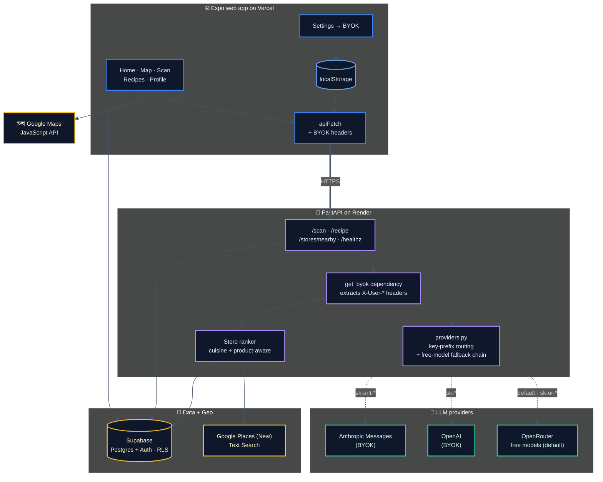
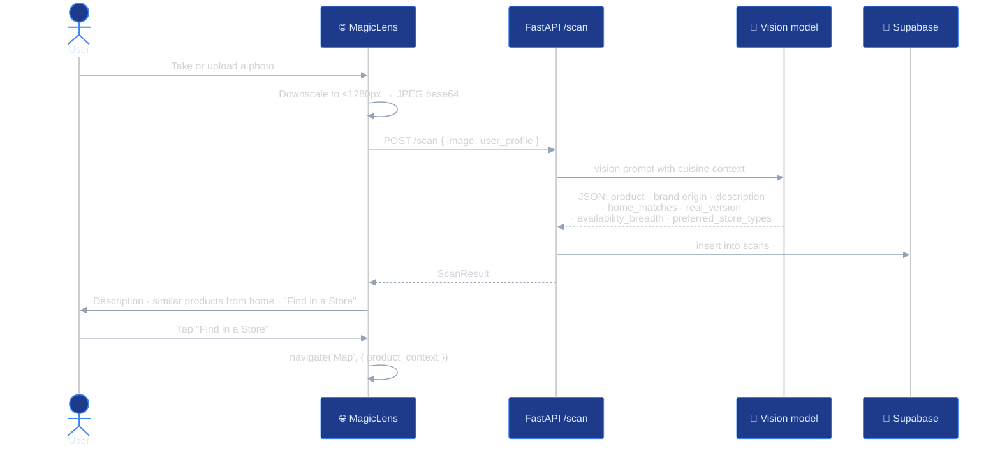
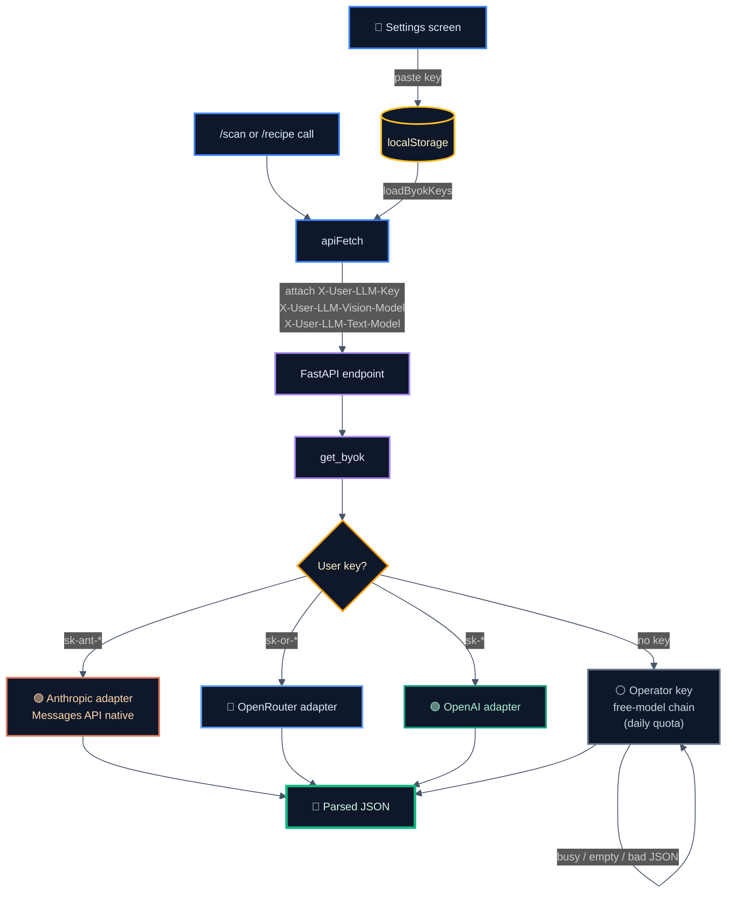
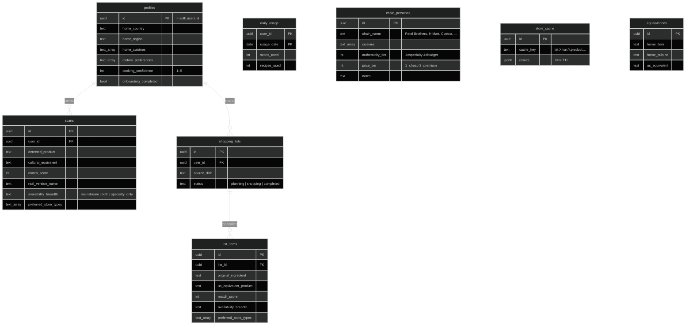

# HomeCart

> Your AI grocery companion for navigating American shelves with home in mind.

HomeCart helps immigrants and travelers translate familiar food products into their US grocery-store equivalents, find specialty stores that carry the *real* thing, and plan recipe shopping trips with confidence. Snap a label, get the cultural translation. Type a dish from back home, get a fully ranked shopping list. Tap **Find stores** — see where the items live, ranked by who covers the most.

Started as a hackathon project (the team won 🥇) as an Android app, and since rebuilt as a **web app** that runs in any modern browser, on desktop or phone.

**Live demo:** [homecart-frontend-five.vercel.app](https://homecart-frontend-five.vercel.app/)

---

## Features

- **🔍 Magic Lens** — take or upload a photo of any US grocery product. A vision model reads the label and returns a "cultural equivalent" rooted in your home cuisine, a match score, and the *real version* you'd ideally want from a specialty store. On phones the upload button opens the camera directly; photos are downscaled in the browser before upload.
- **📒 Recipe Importer** — type a dish ("biryani", "pasta carbonara"). HomeCart returns 8–15 ingredients each with US equivalents, aisle hints, match scores, and an `availability_breadth` classification (mainstream vs specialty).
- **🗺️ Cultural Map** — Google Maps with cuisine filters and product-aware ranking. Specialty-only products (Alphonso mango, fresh paneer) surface ethnic stores; mainstream products (cauliflower, chicken) show the closest mainstream + specialty mix. The recipe-coverage view ranks stores by how many of your ingredients they carry.
- **🆓 Runs on free AI models** — each request walks a chain of free OpenRouter models and falls back to the next one if a model is busy, returns nothing, or returns malformed JSON. When everything is busy, the app says so with a friendly retry card instead of failing silently.
- **🔑 BYOK (Bring Your Own Key)** — plug in your own OpenRouter / OpenAI / Anthropic key for unlimited LLM use. The provider is auto-detected from the key prefix (`sk-or-` → OpenRouter, `sk-ant-` → Anthropic, `sk-` → OpenAI). Keys are stored only in your browser and forwarded as headers on the calls that need them — never persisted on the server.
- **🌑 Dark mode by default**, theme-aware throughout.

---

## Demo

| Personalized home | Magic Lens scan | Recipe importer | Cross-feature map |
|---|---|---|---|
|  |  |  |  |
| Cuisine flag, hero CTA, profile snapshot | "Avocado Oil" → match score + "the real thing" + AI tip | "Biryani" → ingredients with brands, aisles, scores | Tap a scan result → map auto-fits to stores carrying it |

_Screenshots are from the original Android build; the web app shares the same screens and design._

---

## Architecture



---

## How it works

### Magic Lens scan flow



### Recipe → store coverage flow

```mermaid
%%{init: {'theme':'dark', 'themeVariables': {'fontSize':'13px', 'fontFamily':'-apple-system, system-ui, sans-serif', 'lineColor':'#475569'}}}%%
flowchart LR
    Dish["📝 'butter chicken'"]:::input --> Recipe["POST /recipe"]:::backend
    Recipe --> LLM["🧠 Free text model<br/>via OpenRouter"]:::llm
    LLM --> Ings["8-15 ingredients<br/>+ availability_breadth<br/>+ preferred_store_types"]:::data
    Ings --> Save[("💾 Supabase<br/>shopping_lists +<br/>list_items")]:::data
    Ings --> Display["Recipes screen"]:::mobile
    Display --> Either{User picks}
    Either -->|one row| Single["Single-item Map"]:::mobile
    Either -->|Find stores<br/>for this list| Multi["aggregate<br/>product_context"]:::mobile
    Multi --> Nearby["POST /stores/nearby<br/>+ needed_items"]:::backend
    Single --> Nearby
    Nearby --> Places["🗺️ Google Places<br/>Text Search"]:::external
    Nearby --> Personas[("chain_personas<br/>30 chains")]:::data
    Places --> Rank["Per-store coverage"]:::backend
    Personas --> Rank
    Rank --> Filter["Filter 0-coverage<br/>sort distance + coverage"]:::backend
    Filter --> Map["🛒 Stores ranked by<br/>ingredients covered"]:::result

    classDef input fill:#0F172A,stroke:#94A3B8,stroke-width:2px,color:#F1F5F9
    classDef mobile fill:#0F172A,stroke:#3B82F6,stroke-width:2px,color:#DBEAFE
    classDef backend fill:#0F172A,stroke:#A78BFA,stroke-width:2px,color:#EDE9FE
    classDef llm fill:#0F172A,stroke:#34D399,stroke-width:2px,color:#D1FAE5
    classDef data fill:#0F172A,stroke:#FBBF24,stroke-width:2px,color:#FEF3C7
    classDef external fill:#0F172A,stroke:#F472B6,stroke-width:2px,color:#FCE7F3
    classDef result fill:#0F172A,stroke:#10B981,stroke-width:3px,color:#D1FAE5
```



### LLM request routing



---

## Tech stack

| Layer | Tech |
|---|---|
| Web UI | Expo SDK 54 (web export), React Native 0.81 + react-native-web, TypeScript |
| Map | Google Maps JavaScript API via `@vis.gl/react-google-maps` (advanced markers) |
| Navigation | @react-navigation/bottom-tabs 7 |
| Auth + DB | Supabase (Postgres + Auth + RLS) |
| Backend | FastAPI, uvicorn, httpx, Pydantic |
| LLM gateway | OpenRouter free models with a fallback chain (default). Pluggable via BYOK: OpenRouter, OpenAI direct, Anthropic direct |
| Store search | Google Places API (New) Text Search |
| Hosting | Vercel (frontend) · Render free tier (backend) |

---

## Getting started

### Prerequisites

- Node 20+
- Python 3.12+
- Supabase project (free tier OK) with Auth enabled
- Google Cloud project with **Places API (New)** and **Maps JavaScript API** enabled, and two API keys:
  - a **server key** for the backend (API restriction: Places API (New); no application restriction)
  - a **browser key** for the frontend (API restriction: Maps JavaScript API; website restriction: `http://localhost:8081/*` plus your production domain)
- OpenRouter account (free; or your own OpenAI/Anthropic API key)

### Database

Apply the migrations in order via the Supabase SQL Editor:

```
app/migrations/001_initial_schema.sql      # destructive: drops and recreates tables
app/migrations/002_store_cache_chains.sql
app/migrations/003_product_availability.sql
app/migrations/004_fix_handle_new_user.sql
app/migrations/005_daily_usage.sql
```

Then set **Authentication → URL Configuration → Site URL** to wherever the frontend runs (`http://localhost:8081` locally), so email-confirmation links land back in the app.

### Backend

```bash
cd app/backend
python -m venv venv && source venv/bin/activate
pip install -r requirements.txt

# Create .env (gitignored):
cat > .env <<EOF
SUPABASE_URL=https://<project>.supabase.co
SUPABASE_SERVICE_KEY=<service_role_key>
OPENROUTER_API_KEY=sk-or-v1-...
GOOGLE_MAPS_API_KEY=<server key>

# Optional: free models + comma-separated backups, tried in order
LLM_VISION_MODEL=qwen/qwen3.8-27b:free
LLM_VISION_FALLBACKS=google/gemma-4-31b-it:free,google/gemma-4-26b-a4b-it:free,openrouter/free
LLM_TEXT_MODEL=google/gemma-4-31b-it:free
LLM_TEXT_FALLBACKS=nvidia/nemotron-3-super-120b-a12b:free,google/gemma-4-26b-a4b-it:free,openrouter/free
EOF

# Seed reference data (30 grocery chains + curated equivalences):
python seed_chains.py
python seed_equivalences.py

uvicorn main:app --host 0.0.0.0 --port 8000 --reload
```

Free OpenRouter models change over time — check [openrouter.ai/models](https://openrouter.ai/models?max_price=0) if one disappears. Without the `LLM_*` variables the backend uses small paid models (`openai/gpt-5.4-nano`, `deepseek/deepseek-v4-flash`).

### Frontend

```bash
cd app/frontend
npm install
cp .env.example .env   # then fill in:
#   EXPO_PUBLIC_API_URL=http://localhost:8000
#   EXPO_PUBLIC_SUPABASE_URL=...
#   EXPO_PUBLIC_SUPABASE_ANON_KEY=...          (anon/publishable key — never the service key)
#   EXPO_PUBLIC_GOOGLE_MAPS_BROWSER_KEY=...    (the referrer-restricted browser key)

npm start              # http://localhost:8081
npm run build          # static export to dist/
```

Every `EXPO_PUBLIC_*` value is baked into the public JavaScript bundle, so only put browser-safe values there.

---

## BYOK — bring your own key

Signed-in users get a free daily allowance on the shared key (10 scans + 3 recipes per day). For unlimited use, open **Profile → Settings** and paste a key:

| Provider | Detected prefix | Where to get it |
|---|---|---|
| OpenRouter | `sk-or-*` | [openrouter.ai/keys](https://openrouter.ai/keys) |
| OpenAI | `sk-*` (anything else) | [platform.openai.com/api-keys](https://platform.openai.com/api-keys) |
| Anthropic | `sk-ant-*` | [console.anthropic.com/settings/keys](https://console.anthropic.com/settings/keys) |

The key is saved in your browser's localStorage only, attached as a request header on scan and recipe calls, and **never persisted server-side**. Don't save it on a shared computer. Maps and store search always run on the operator's keys.

---

## Database schema



All user-owned tables (`profiles`, `scans`, `shopping_lists`, `list_items`, `daily_usage`) are protected by Row Level Security policies (`auth.uid() = user_id`). The reference tables (`chain_personas`, `store_cache`, `equivalences`) are readable by authenticated users.

---

## Deployment

### Backend → Render

1. Push to GitHub.
2. Render dashboard → **New → Blueprint** → pick this repo. Render reads `app/backend/render.yaml` and provisions a Python service.
3. Set the backend env vars (same as the local `.env`, including the optional `LLM_*` ones).
4. Apply. The first deploy takes ~3–5 minutes.

Render's free tier sleeps after 15 minutes without traffic; the first request afterwards takes ~30–60 seconds, and the app shows a "server is waking up" message with a retry button. To keep it warm, point a free [UptimeRobot](https://uptimerobot.com) monitor at `https://<your-service>.onrender.com/healthz` every 5 minutes.

### Frontend → Vercel

1. Vercel dashboard → **Add New → Project** → import this repo.
2. Set **Root Directory** to `app/frontend`. `vercel.json` supplies the build command (`expo export --platform web`) and output directory (`dist`).
3. Add the environment variables: `EXPO_PUBLIC_API_URL` (your Render URL), `EXPO_PUBLIC_SUPABASE_URL`, `EXPO_PUBLIC_SUPABASE_ANON_KEY`, `EXPO_PUBLIC_GOOGLE_MAPS_BROWSER_KEY`, and optionally `EXPO_PUBLIC_GOOGLE_MAPS_MAP_ID`.
4. Deploy, then with the new `https://<app>.vercel.app` address:
   - add `https://<app>.vercel.app/*` to the browser key's website restrictions in Google Cloud;
   - set Supabase's **Site URL** to it;
   - create a Map ID in Google Cloud → **Map Management** and set `EXPO_PUBLIC_GOOGLE_MAPS_MAP_ID` (the default `DEMO_MAP_ID` is for development only).

---

## Roadmap

- [x] Magic Lens, Recipe Importer, Map
- [x] Product-aware store ranking (mainstream / specialty / both)
- [x] Per-recipe-ingredient coverage view (specialty grocers credited with everyday staples)
- [x] BYOK for LLM providers
- [x] OpenRouter gateway with a free-model fallback chain
- [x] Web app (Expo web + Google Maps JavaScript API)
- [x] Deploy: backend on Render, frontend on Vercel
- [ ] Tavily fallback for thin-metro store discovery
- [ ] Firecrawl enrichment of `ai_tip` with "where to buy" data
- [ ] App icon + branding refresh

---

## License

MIT — see [LICENSE](LICENSE).

## Acknowledgements

Built by [@p-kowadkar](https://github.com/p-kowadkar) and the hackathon team. Web version by [@miriamcontinodesign](https://github.com/miriamcontinodesign). Powered by Google Maps Platform, Supabase, and OpenRouter.
